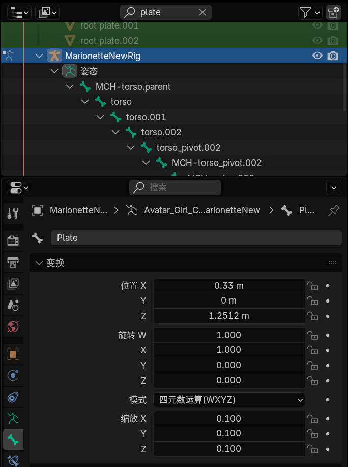

# Blender

## 借助MMDBridge烘焙物理

个人体验来说Blender的mmdtools自带的物理烘焙效果很差，总是穿模，于是听从建议使用MMDBridge来烘焙物理，效果好多了，以下是具体步骤:

步骤图附上:

- 导入模型就不说了, 重点是在Blender里面修复骨骼和修复变形, 然后将修复的模型导出
- 重新打开Blender, 导入修复好的模型, 创建预设(渲染, 材质等), 打包成Blender文件后, 另存到工程地址
- 进入MMD, 导入模型和动作, 修改动作防止穿模, 其他同图
- 一定要选择装配变形!!! 在blender导入动作时, 必须同时选中角色网格和骨骼

## 关于使用FBX模型对vmd动作重定向的一些问题

### 重定向后表情面板位置约束失效

由于ARP重定向后会清除骨骼的当前姿态, 而表情面板 `Plate` 初始姿态并不是在 `Plate Board` 内的

解决方式: 在`Overlay`搜索`Plate`，进入`Pose Mode`记住原有变换, 重定向后将原有变换数值重新填入数值:

# Unity

使用HoyoToon实现

