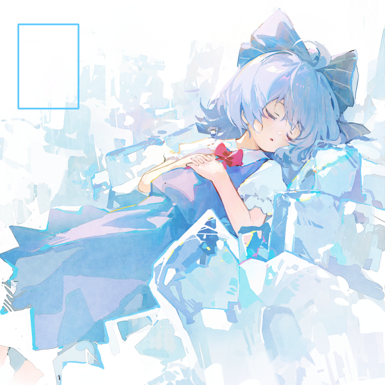

# OpenCV基础

## 基本读写

|          函数          |             描述             |
| :--------------------: | :--------------------------: |
|      cv.imread()       |        从文件读取图像        |
|     cv.imdecode()      |     从内存缓冲区读取图像     |
|      cv.imshow()       |     在openCV窗口显示图像     |
|      cv.imwrite()      |        将图像写入文件        |
|      cv.waitKey()      | 等待按键输入, 参数为等待时间 |
| cv.destroyAllwindows() |         释放所有窗口         |

函数`imread()`用于读取图像文件, 其用法为: `cv.imread(filename[, flags])`

其中`flags`为读取模式, 取值如下:

- `cv.IMREAD_GRAYSCALE`: 将图像作为灰度图读取
- `cv.IMREAD_COLOR`: 默认值, 将图像作为BGR三通道彩色图像读取
- `cv.IMREAD_ANYDEPTH`: 当输入图像具有相应深度时返回 16 位/32 位图像，否则将其转换为 8 位图像
- `cv.IMREAD_UNCHANGED`: 载入原图(包括alpha通道)

更多参数可以查阅OpenCV官方文档

使用示例:

```py
import cv2 as cv
import sys
img = cv.imread("cirno.png", cv.IMREAD_COLOR) #注意:imread不支持中文路径
cv.imshow("hello opencv", img)
if img is None:
    sys.exit("无法读取图像")
cv.waitKey(0)
cv.destroyAllWindows()
```

使用`imdecode()`函数可以读取内存缓冲区中的图像, 配合`fromfile()`函数可完成中文路径的图像读取, 其用法为: `cv.imdecode(buf, flags)`

其中`buf`是存放图像数据的内存缓存, 通常用数组或字节向量表示. 如果内存缓冲区太短或者包含无效数据, 则返回空矩阵图像

使用示例:

```py
import cv2 as cv
import sys
import numpy as np
img = cv.imdecode(np.fromfile("琪露诺.png", dtype=np.uint8), cv.IMREAD_GRAYSCALE)
cv.imshow("hello opencv", img)
if img is None:
    sys.exit("无法读取图像")
cv.waitKey(0)
cv.destroyAllWindows()
```

 由于读取到的图像都是用矩阵表示的, 因此可以获取图像的长宽和通道数:

```py
img = cv.imread("cirno.png", cv.IMREAD_UNCHANGED)
height, width, channels = np.shape(img)[:3]
print("height=", height, "width=", width, "channels=", channels)
```

```
height= 640 width= 640 channels= 4
```

使用`imwrite()`可以输出图像到文件, 用法为: `cv.imwrite(filename, img[, params])`

其中`params`表示特定格式保存的参数, 例如:

- `cv.IMWRITE_PNG_COMPRESSION`: 对于PNG格式保存, 压缩级别可在 0 到 9 之间. 值越高, 文件大小越小, 压缩时间越长, 默认值为1(最佳速度设置)
- `cv.IMWRITE_JPEG_QUALITY`: 对应JPEG格式保存, 质量范围在0~100, 默认值为95

更多参数可以查阅OpenCV官方文档

使用示例:

```py
#把png图片右上角改为半透明, 并输出
import cv2 as cv

img = cv.imread("cirno.png", cv.IMREAD_UNCHANGED)
b, g, r, a = cv.split(img)
print(a.shape)
a[:int(a.shape[0]/2), int(a.shape[1]/2):] = 127
img = cv.merge((b, g, r, a))
cv.imshow("img", img)
cv.waitKey(0)
cv.destroyAllWindows()
cv.imwrite("cirno1.png", img, [cv.IMWRITE_PNG_COMPRESSION, 9]) #opencv的查看窗口无法看到透明效果, 必须保存后查看
```


## 基础图像处理

### 颜色空间转换

通过`cvtColor()`函数进行颜色空间的转换, 可以将图片转换成灰度图, 二值图, HSV以及HSI等不同颜色空间, 其用法为: `cv.cvtColor(src, code[, dst[, dstCn]])` 

其中`code`表示颜色空间转换参数, `dst`表示输出与`src`相同大小和深度的图像, `dstCn`表示目标图像通道数, 其默认值为0, 即根据源图像和目标图像自动确定

```py
#将图像分别转换为灰度图和
src_img = cv.imread("cirno.png", cv.IMREAD_UNCHANGED)
gray_img = cv.cvtColor(src_img,cv.COLOR_BGR2GRAY)
hsv_img = cv.cvtColor(src_img,cv.COLOR_BGR2HSV)
h, s, v = cv.split(hsv_img)
cv.imshow("gray_img", gray_img)
cv.imshow("h", h) #色调
cv.imshow("s", s) #饱和度
cv.imshow("v", v) #灰度
#由于opencv内部窗口只能显示BGR格式的图像, 所以不能正常显示HSV图像
cv.waitKey(0)
cv.destroyAllWindows()
```


### 基本图形绘制

|      函数      |      描述      |
| :------------: | :------------: |
| cv.rectangle() |    绘制矩形    |
|  cv.circle()   |    绘制圆形    |
|  cv.ellipse()  |    绘制椭圆    |
|   cv.line()    |    绘制线段    |
| cv.polylines() |   绘制多边形   |
| cv.fillPoly()  | 绘制填充多边形 |

更多绘制函数可以查看OpenCV官方文档

使用`cv.rectangle()`可以绘制矩形, 其用法为

`cv.rectangle(img, pt1, pt2, color[, thickness[, lineType[, shift]]])`

或者

`cv.rectangle(img, rec, color[, thickness[, lineType[, shift]]])` 

其中`pt1`和`pt2`表示对角线的两个点坐标元组, `rec`表示左上角坐标和宽高组成的元组, `color`表示矩形的颜色或亮度(灰度图像), `thickness`表示线条粗细, 取负值时(如`cv.FILLED`)表示绘制填充矩形, `lineType`表示线条类型, `shift`表示点坐标的移位位数 

使用示例:

```py
#在图像左上角绘制一个100x150的边框, 颜色为66ccff
src_img = cv.imread("cirno.png", cv.IMREAD_UNCHANGED)
rec = (30, 40, 100, 150)
img = cv.rectangle(src_img, (30, 40), (130, 180), (255, 204, 102, 0), 2) #使用rec参数可以写成(30, 40, 100, 150)
cv.imshow("img", img)
cv.waitKey(0)
cv.destroyAllWindows()
```

输出图像:




